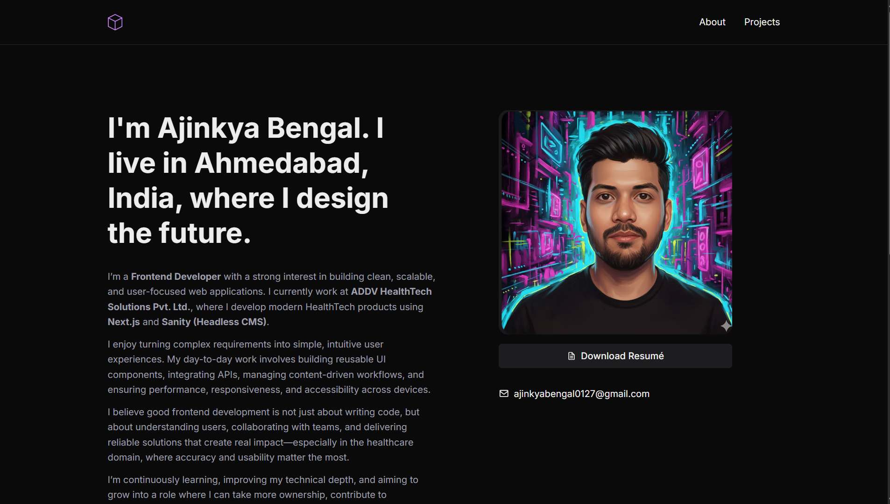

# 👨‍💻 Ajinkya's Portfolio

A modern full-stack portfolio website built with **Next.js 15**, **TypeScript**, **Sanity CMS**, and **Tailwind CSS**.



### ⚡ Fast • 🎨 Modern • 📈 SEO Optimized • 🧠 CMS Driven

---

## ✨ About The Project

This is a dynamic developer portfolio designed to showcase projects, experience, and skills while allowing easy content management through **Sanity CMS**.

The project focuses on performance, scalability, and modern UI/UX using the **Next.js App Router** and **Incremental Static Regeneration (ISR)**.

---

## 🛠 Tech Stack

| Category | Technology |
|----------|-----------|
| ⚡ Frontend Framework | Next.js 15 (App Router) |
| 💻 Language | TypeScript |
| 🎨 Styling | Tailwind CSS + PostCSS |
| 🧠 CMS | Sanity Headless CMS |
| 🖼 Image Optimization | next-sanity/image |
| 🚀 Deployment | Vercel |
| 🧹 Code Quality | ESLint |

---

## 🚀 Key Features

- ✅ **Dynamic Content Management** — Edit portfolio, projects, and jobs in Sanity Studio
- ✅ **Real-time Updates** — Webhook-triggered ISR for instant content refresh
- ✅ **Fully Responsive** — Mobile-first UI with Tailwind CSS
- ✅ **Type-Safe** — Full TypeScript support across the entire stack
- ✅ **SEO Optimized** — Dynamic metadata, Open Graph, and structured data
- ✅ **Fast Performance** — Image optimization and edge deployment on Vercel
- ✅ **Clean Architecture** — Reusable components and well-organized code structure

---

## 📋 Prerequisites

- **Node.js** 18+ (recommended: 20 LTS)
- **npm** or **yarn**
- Sanity account ([free tier available](https://sanity.io))

---

## 🔧 Quick Start

### 1. Clone & Install

```bash
git clone <your-repo-url>
cd portfolio-site-nextjs-sanity
npm install
```

### 2. Setup Environment Variables

Create a `.env.local` file in the root directory:

```env
NEXT_PUBLIC_SANITY_PROJECT_ID="your-project-id"
NEXT_PUBLIC_SANITY_DATASET="your-dataset-name"
NEXT_PUBLIC_SANITY_API_VERSION="2026-01-26"
```

Get your values from [Sanity Dashboard](https://sanity.io/manage).

### 3. Run Development Server

```bash
npm run dev
```

- Portfolio: [http://localhost:3000](http://localhost:3000)
- Sanity Studio: [http://localhost:3000/studio](http://localhost:3000/studio)

### 4. Build for Production

```bash
npm run build
npm start
```

---

## 📁 Project Structure

```
portfolio-site-nextjs-sanity/
├── app/
│   ├── (site)/                      # Public portfolio pages
│   │   ├── page.tsx                 # Homepage
│   │   ├── about/page.tsx           # About page
│   │   ├── projects/page.tsx        # Projects listing
│   │   ├── projects/[project]/      # Dynamic project detail
│   │   ├── components/              # Reusable components
│   │   └── icons/                   # SVG icons
│   ├── (studio)/                    # Sanity Studio route
│   ├── api/revalidate/route.ts      # ISR webhook endpoint
│   └── globals.css                  # Global styles
├── sanity/
│   ├── lib/
│   │   ├── sanity.client.ts        # Sanity client config
│   │   ├── sanity.query.ts         # GROQ queries
│   │   └── live.ts                 # Live content API
│   ├── schemaTypes/
│   │   ├── profile.ts              # Profile schema
│   │   ├── project.ts              # Projects schema
│   │   └── job.ts                  # Jobs schema
│   ├── structure.ts                # Studio structure
│   └── env.ts                      # Environment config
├── types/
│   └── index.ts                    # TypeScript types
├── public/                         # Static assets
└── sanity.config.ts                # Sanity Studio config
```

---

## 📝 Content Types

### 👤 Profile
Personal information, bio, resume, and social links.

### 💼 Projects
Dynamic projects with slug-based routing, tech stack, and live links.

### 🏢 Jobs
Work experience and employment history.

---

## 🔄 Content Workflow

1. Navigate to **Sanity Studio** at `/studio`
2. Create or edit content (Profiles, Projects, Jobs)
3. Click **Publish** to save changes
4. Changes reflect **instantly locally** and **within 30 seconds on production** (via webhooks)

---

## 🪝 Webhook Setup (Production ISR)

### 1. Revalidation Endpoint ✅
Already created in `app/api/revalidate/route.ts`

### 2. Create Sanity Webhook

1. Go to [Sanity Dashboard](https://sanity.io) → Project → **API** → **Webhooks**
2. Click **Create Webhook**
3. Configure:
   - **URL:** `https://your-domain.vercel.app/api/revalidate`
   - **Events:** "Publish" and "Unpublish"
   - **Filter:** `_type in ["profile", "job", "project"]`
4. Save and test

---

## 🚀 Deploy to Vercel

### 1. Push to Git

```bash
git add .
git commit -m "Initial commit"
git push origin main
```

### 2. Connect to Vercel

1. Go to [vercel.com](https://vercel.com)
2. Import your Git repository
3. Click **Deploy**

### 3. Add Environment Variables

In Vercel Dashboard:
- Go to **Settings → Environment Variables**
- Add all three `NEXT_PUBLIC_SANITY_*` variables for **Production**
- Redeploy

---

## 📚 Useful Commands

```bash
# Development
npm run dev                         # Start dev server

# Production
npm run build                       # Build optimized bundle
npm start                           # Run production server

# Code Quality
npm run lint                        # Run ESLint

# Sanity
npx sanity@latest schema deploy    # Deploy schema changes
```

---

## 🐛 Troubleshooting

### Studio not loading?
- Check `.env.local` has correct Sanity credentials
- Verify `NEXT_PUBLIC_SANITY_PROJECT_ID` and `NEXT_PUBLIC_SANITY_DATASET`

### Changes not reflecting on production?
- Ensure webhook is created in Sanity dashboard
- Check Vercel env vars are set for production
- Manually redeploy if needed

### Images not loading?
- Verify images are published in Sanity
- Check `useCdn` setting in `sanity.client.ts`

---

## 🔗 GROQ Queries Reference

Key queries in `sanity/lib/sanity.query.ts`:

```typescript
// Fetch all profiles
*[_type == "profile"]

// Fetch all projects
*[_type == "project"] | order(publishedAt desc)

// Fetch single project by slug
*[_type == "project" && slug.current == $slug][0]

// Fetch all jobs
*[_type == "job"] | order(endDate desc)
```

---

## 🎨 Styling & Design

- **Tailwind CSS** for utility-first styling
- **Dark theme** (zinc-900 bg, white text)
- **Mobile-first responsive design**
- **Smooth animations and transitions**

### Responsive Breakpoints
- `sm`: 640px | `md`: 768px | `lg`: 1024px | `xl`: 1280px | `2xl`: 1536px

---

## 📖 Learning Resources

- [Next.js Docs](https://nextjs.org/docs)
- [Sanity Documentation](https://www.sanity.io/docs)
- [Tailwind CSS](https://tailwindcss.com/docs)
- [GROQ Query Language](https://www.sanity.io/docs/groq)

---

## 📄 License

MIT License — Feel free to use this project for your own portfolio.

---

## 👤 Author

**Ajinkya Bengal**

Frontend Developer passionate about building modern, scalable web applications.

📧 ajinkyabengal0127@gmail.com

---

<div align="center">

⭐ **If you like this project, consider giving it a star!**
                      
[View Live](https://ajinkya-portfolio-nine.vercel.app) • [Sanity CMS](https://sanity.io) • [Next.js](https://nextjs.org)

</div>

---

**Last Updated:** February 7, 2026  
**Next.js:** 15 | **Node.js:** 18+ | **TypeScript:** Latest
